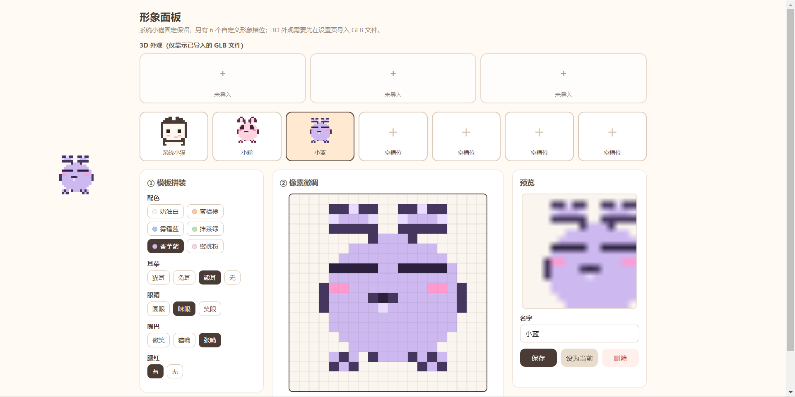

# 桌面宠物·陪伴

像素风桌面宠物，主打情感陪伴，类似当年的 QQ 宠物。



## 开源 & 开发

本项目采用 MIT 协议开源，欢迎 Star 和 PR。

整个项目的开发过程几乎完全由 AI 完成，使用的 AI 工具是 [opencode](https://github.com/anomalyco/opencode)，主要靠里面的免费模型额度一路写下来。

免费模型搞不定的地方，靠这两个中转站补上：

* [kklt](https://fuckme.kklt.lol/) — 便宜、模型全
* [443AI](https://fuckme.443.hk/) — 价格实惠、接口稳定

这两个中转便宜好用，覆盖了免费模型覆盖不到的场景。项目还会持续迭代，欢迎大家给个 Star ⭐

## 快速使用

### 直接安装（已打包）

- 安装包：`dist/Desktop Pet Setup 1.26.0.exe`
- 双击安装后，桌面右下角托盘会出现宠物图标，宠物会出现在屏幕上。
- 如果没有安装包，见下方「从源码打包」。

### 从源码运行

```bash
npm install
npm start
```

### 打包安装包

```bash
npm run pack
# 产物在 dist/ 下
```

## 功能

- **养成系统**：饱食 / 心情 / 清洁 / 健康 / 亲密度，会随时间自然衰减，需要投喂、玩耍、洗澡来维持。
- **互动反应**：左键点它（戳它）、按住拖拽移动、右键弹出操作按钮。
- **3D 外观**：支持导入 `.glb` 模型作为宠物外观，可在形象面板中导入、替换、切换和管理。
- **气泡对话**：宠物会在头顶气泡说话，早安晚安、节日祝福、饿了脏了都会主动说。
- **AI 对话**：设置里填入 OpenAI 兼容的 API Key 后可真正陪聊；留空则用内置的可爱回复。
- **日常陪伴**：定时提醒喝水休息、节日祝福。
- **托盘菜单**：聊天 / 喂食 / 玩耍 / 洗澡 / 设置 / 退出。
- **可调大小**：默认尺寸为原版一半，设置里可在「迷你~巨大」间自定义（像素放大 3~12 倍）。
- **点击穿透**：只有宠物本体像素会拦截鼠标，透明区域不挡页面，可以正常点桌面其他内容。

## 玩法提示

| 操作 | 效果 |
| ---- | ---- |
| 左键点宠物 | 戳它，它喵一声，心情和亲密度上升 |
| 按住拖拽 | 移动宠物到桌面任意位置 |
| 右键点宠物 | 弹出 喂食 / 玩耍 / 洗澡 / 聊天 按钮 |
| 托盘右键菜单 | 全部功能入口 |
| 宠物走动 | 待机时会随机在桌面上走动 |
| 设置 → 宠物尺寸 | 调整宠物大小（默认已缩小为原尺寸一半） |

## 扩展：添加新的宠物

宠物系统是插件化的，一个宠物就是一个 JS 文件，放在 `src/renderer/pets/` 下，格式参考 `cat.js`：

```js
const catDef = {
  id: 'dog',                    // 唯一 id
  name: '旺财',                 // 显示名
  type: 'pixel',                // 渲染类型，预留 '3d' 等新类型
  size: { w: 16, h: 16 },       // 像素画尺寸（宽 x 高，单位：像素）
  palette: { '.': null, o: '#4a3b35', w: '#fff8f0', ... },  // 字符 → 颜色
  frames: {
    idle: [/* 帧数组 */],
    blink: [...],
    happy: [...],
    sad: [...],
    sleep: [...],
    eat: [...],
    talk: [...],
    drag: [...],
    walk: [...],
  },
  animMeta: { idle: { loop: true, fps: 4 }, ... },  // 每段动画的播放参数
  baseStats: { hunger: 80, mood: 80, clean: 80, health: 90, affection: 0 },
};

if (typeof module !== 'undefined' && module.exports) module.exports = catDef;
if (typeof window !== 'undefined') window.__catDef = catDef;
```

然后在 `src/renderer/app.js` 的 `pets` 对象里注册，并在设置页 `src/renderer/settings.js` 的 `PETS` 数组里加上名字。

### 像素画说明

- 每个字符代表一个像素，`.` 表示透明。
- 颜色从 `palette` 里按字符查表，可以自己配色。
- 用 `scripts/preview-pet.js` 可在终端里预览像素画效果。

### 3D 模型制作

支持导入 `.glb` 格式的 3D 模型作为宠物外观，详细制作与导入指南见 [docs/3d-model-guide.md](docs/3d-model-guide.md)。免费工具推荐 Blender、Meshy、Tripo AI、Mixamo 等。

## 配置数据

- 设置文件：`%APPDATA%/桌面宠物·陪伴/settings.json`（含 `petScale` 宠物尺寸等）
- 宠物状态：`%APPDATA%/桌面宠物·陪伴/state.json`

## 技术栈

- Electron 33
- 原生 Canvas 像素渲染，无第三方运行时依赖
- Three.js（3D 模型渲染）
- 数据持久化：JSON 文件（userData 目录）
